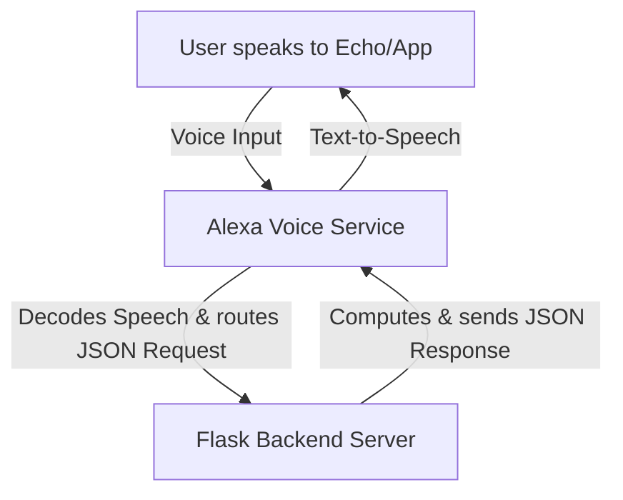

# Alexa Skills Introduction

This document provides a beginner-friendly overview of Alexa Skills, explaining the core concepts needed to understand how voice commands control the Arduinobot.

---

## What is an Alexa Skill?

An Alexa Skill is essentially an app for Alexa-enabled devices (like the Echo Dot or the Alexa app on your phone). It extends Alexa's default capabilities by mapping spoken commands (voice inputs) to custom backend code.

---

## Key Concepts

To build or use an Alexa Skill, you must understand three key components of the **Interaction Model**:

### 1. Intents
An **Intent** represents an action that fulfills a user's spoken request. 
In the Arduinobot remote project, we define three custom intents:
- **`WakeIntent`**: Tells the robot to wake up and get ready.
- **`PickIntent`**: Tells the robot to perform a pick/place action.
- **`SleepIntent`**: Tells the robot to return to its home/sleep position.

### 2. Utterances
An **Utterance** is a phrase or sentence that a user says to trigger an intent. You must configure multiple utterances per intent because users speak differently.
- *Example for `PickIntent`*: "pick", "grab", "pick up", "execute pick"
- *Example for `SleepIntent`*: "sleep", "go to sleep", "shut down"

### 3. Launch Request
The **Launch Request** is triggered when a user opens the skill without invoking a specific command (e.g., *"Alexa, open my Arduinobot"*). It initializes the skill session.

---

## How it works for Arduinobot
Spoken voice commands are processed in the cloud by the **Alexa Voice Service**. The service translates the audio into structured JSON data identifying the **Intent** and forwards it to our Flask application via an HTTPS request. The Flask application then executes the corresponding movement command via ROS 2.
