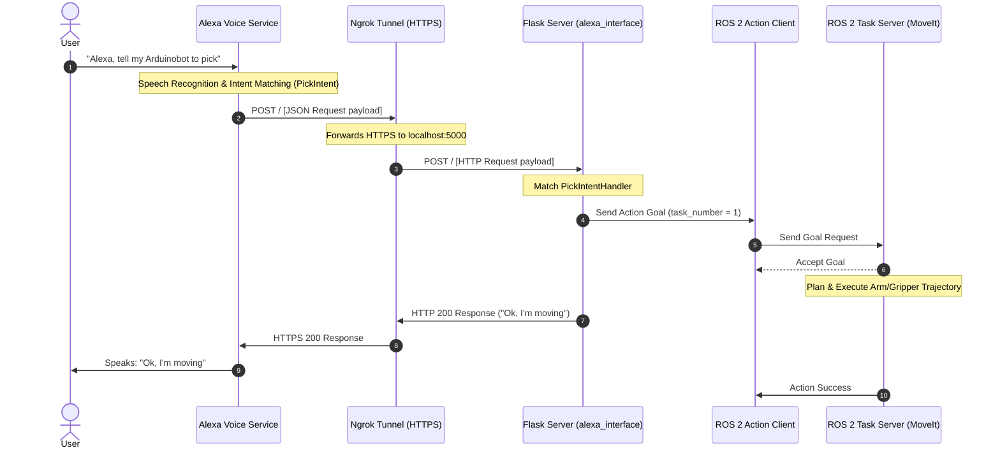

# System Architecture & Request Flow

This document details the system architecture of the remote control interface and the technical mechanism used to bridge HTTP web servers (Flask) with the ROS 2 network.

---

## Technical Overview

The remote interface runs two concurrent systems inside the [alexa_interface.py](../../arduinobot_remote/alexa_interface.py) node:
1. **Python Flask Web Server**: Listens for HTTP requests sent by the Alexa Voice Service.
2. **ROS 2 Action Client**: Sends goals to the `task_server` node to move the robot.

Because both the Flask server (`app.run()`) and ROS 2 executor (`rclpy.spin()`) block their execution threads, we run them on separate threads:
* **Background Thread**: Initializes `rclpy` and runs the ROS 2 communication nodes.
* **Main Thread**: Runs the Flask web application to serve HTTP requests.

---

## Flask / ASK-SDK Code Structure

Inside `alexa_interface.py`, the Alexa side of the request handling is built with the `ask-sdk-python` and `flask-ask-sdk` libraries, which sit on top of the Flask app:

* **`SkillBuilder`**: Registers all the `RequestHandler` classes and builds the skill instance that will process incoming requests.
* **`SkillAdapter`**: Bridges the `SkillBuilder`'s skill instance with the Flask routing, so incoming HTTP POSTs are handed off to the Alexa SDK's dispatch logic instead of being parsed manually.
* **`RequestHandler` classes** (e.g. `LaunchRequestHandler`, `PickIntentHandler`, `SleepIntentHandler`): Each implements two methods:
    * `can_handle(handler_input)`: Returns `True`/`False` — whether this handler should process the incoming request.
    * `handle(handler_input)`: Contains the logic that runs when the handler is selected. This is where the ROS 2 action goal is sent (see Detailed Request Flow below) and the Alexa speech response is built.

At startup, each `RequestHandler` is registered with the `SkillBuilder`, which is then wrapped by the `SkillAdapter` and attached to a Flask route (typically `/`). This is what allows a single POST endpoint to correctly dispatch `LaunchRequest`, `PickIntent`, and `SleepIntent` payloads to their respective handlers.

---

## Detailed Request Flow

Below is the step-by-step communication flow from the user's voice command to the robot movement:

---

## ROS 2 Task Mapping

The Action Client sends an `ArduinobotTask` action containing a `task_number`. The Task Server maps these integers to specific joint targets:

| Voice Command / Intent | `task_number` | Arm Joint Angles (Joints 1-3) | Gripper Positions (Left, Right) | Robot State |
|---|---|---|---|---|
| **LaunchRequest** / **WakeIntent** | `0` | `[0.0, 0.0, 0.0]` rad | `[-0.7, 0.7]` rad | Home / Ready |
| **PickIntent** | `1` | `[-1.14, -0.6, -0.07]` rad | `[0.0, 0.0]` rad | Pick position |
| **SleepIntent** | `2` | `[-1.57, 0.0, -0.9]` rad | `[0.0, 0.0]` rad | Sleep position |
