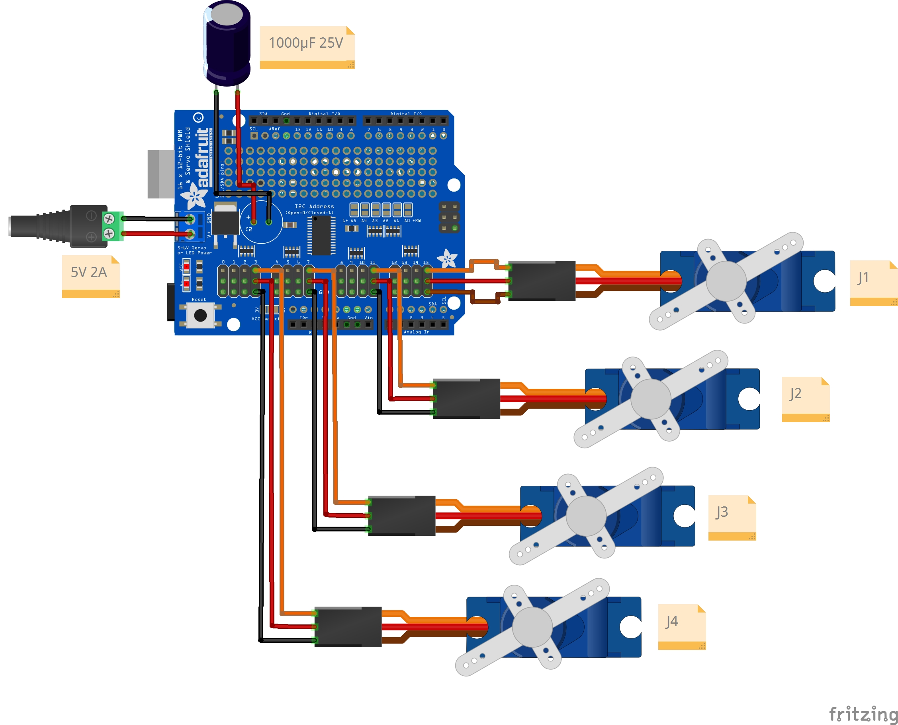

# Electronics & PCA9685 Integration

This document outlines the custom hardware circuitry, power delivery strategy, and wiring layout for the Arduinobot.

---

## PCA9685 PWM Driver Shield Integration

Unlike the baseline course design — which connects servo signal lines directly to the digital output pins of the Arduino Uno using `Servo.h` — this implementation offloads all PWM generation to the **PCA9685 16-Channel 12-Bit PWM Driver Shield** connected over I2C (`SDA` / `SCL`).

### Key Benefits

1. **Reduced Wiring:** Requires only 4 control lines from the Arduino Uno (`5V`, `GND`, `SDA`, `SCL`) to drive up to 16 servos.
2. **Dedicated Power Delivery:** Allows external 5V/6V high-current power to be supplied directly to the PCA9685 screw terminals, protecting the Arduino from current spikes and brownouts caused by motor stall currents.
3. **Pin Optimization:** Keeps remaining Arduino digital and analog pins open for telemetry, external sensors, or future hardware expansions.

---

## Wiring & Fritzing Schematic

Below is the complete breadboard layout for the PCA9685 driver, MG90S metal-gear servos, and external power supply connection:

---

## Servo Pin Mapping

| Joint | Servo Motor | PCA9685 Channel | Power Supply |
|---|---|---|---|
| **Joint 1 (Base Turret)** | MG90S Metal-Gear | Channel 15 | External 5V/6V Terminal |
| **Joint 2 (Shoulder)** | MG90S Metal-Gear | Channel 11 | External 5V/6V Terminal |
| **Joint 3 (Elbow)** | MG90S Metal-Gear | Channel 7 | External 5V/6V Terminal |
| **Joint 4 (Gripper/Claw)** | MG90S Metal-Gear | Channel 3 | External 5V/6V Terminal |

---

## Next Steps

- Calibration and pulse limit discovery → [Servo Pulse Calibration Guide](./servo-calibration.md)
